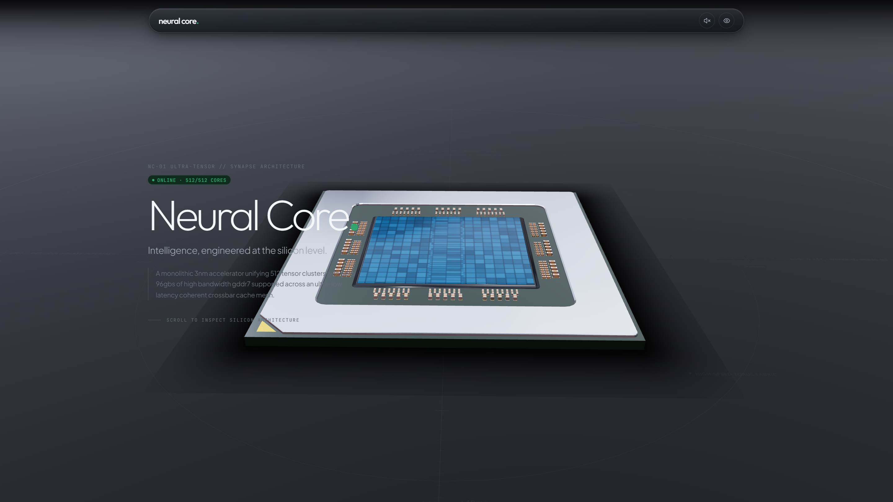
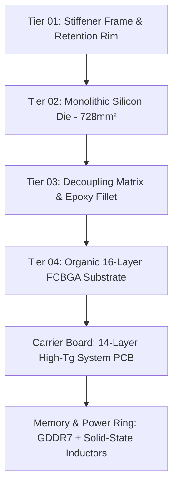
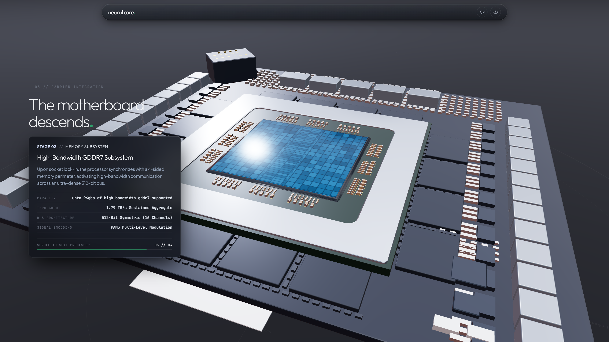
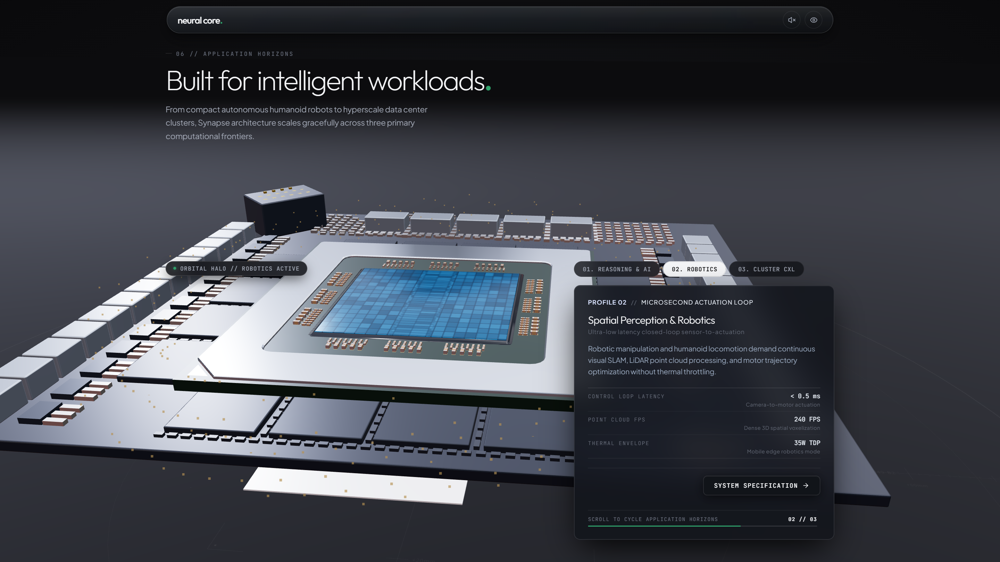
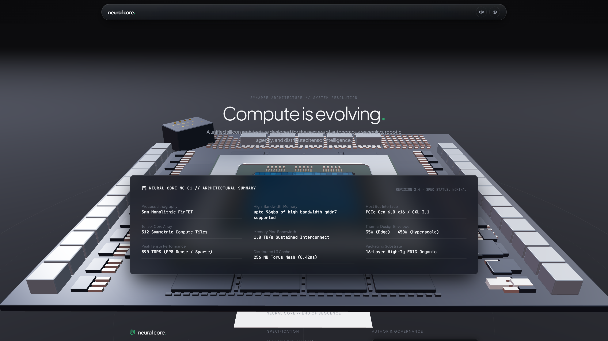

# NEURAL CORE // NC-01 ULTRA-TENSOR

**Next-Generation Monolithic Silicon Architecture & Cognitive Compute Engine**

     

---

## Overview

[Neural Core (NC-01)](https://neural-core-a-new-future.vercel.app/) is an exploratory 3D silicon monograph and interactive architectural web experience. This project serves as an experimental exploration of high-density compute, packaging, and futuristic interface design.

> **Disclaimer**: All hardware specifications, compute metrics, and packaging data presented throughout this project are purely fictional and designed specifically for visual storytelling, 3D composition, and interactive web experimentation.

Featuring an exploded nanoscale hardware disassembly, simulated 512-core silicon fabric telemetry, and interactive cross-sectional packaging exploration, Neural Core pushes the frontier of web-based technical storytelling.



```
 _   _                      _    ____                 
| \ | | ___ _   _ _ __ __ _| |  / ___|___  _ __ ___   
|  \| |/ _ \ | | | '__/ _` | | | |   / _ \| '__/ _ \  
| |\  |  __/ |_| | | | (_| | | | |__| (_) | | |  __/  
|_| \_|\___|\__,_|_|  \__,_|_|  \____\___/|_|  \___|  
             NC-01 ULTRA-TENSOR // SYNAPSE ARCHITECTURE
```

---

## Silicon Architecture & Fabrication Tiers

Neural Core breaks down silicon packaging into four distinct fabrication tiers using interactive 3D camera staging and GSAP-driven scroll sequencing:





### 1. Tier 01 // Structural Retention Rim

* **Material**: Aircraft-Grade CNC Anodized Silver Alloy with satin micro-finish.  
* **Dimensions**: `53.8mm × 53.8mm` (0.6mm margin, 0.42mm thickness).  
* **Engineering**: 45° Pin-1 corner notch, 0.20mm inner chamfer lip, and calibrated vapor chamber clamping interface.

### 2. Tier 02 // Monolithic Compute Die (Exposed NPU)

* **Process Lithography**: TSMC 3nm Monolithic FinFET.  
* **Die Footprint**: `28.0mm × 26.0mm` (728 mm² die area, 0.40mm profile).  
* **Microarchitecture**: Dense repeating systolic multiplier arrays (MAC tiles) flanking central high-density SRAM cache blocks with iridescent monocrystalline optical refraction.

### 3. Tier 03 // On-Package Decoupling Matrix & Underfill

* **Passive Arrays**: High-density `0402` and `0201` multi-rail MLCC capacitor banks bordering all four package quadrants with gold solder pads.  
* **Environmental Sealing**: Continuous `0.6mm` glossy black epoxy underfill fillet protecting microscopic C4 interconnects.

### 4. Tier 04 // High-Density FCBGA Substrate

* **Package Stack**: 16-layer high-Tg organic laminate (`55.0mm × 55.0mm × 1.6mm`).  
* **Metallurgy & Coating**: Taiyo dark matte charcoal soldermask, flush gold Pin-1 alignment indexing, and ENIG test points.

---

## Hardware Specifications (Fictional Concept)

| Specification Metric | Technical Detail |
| :--- | :--- |
| **Silicon Process** | 3nm Monolithic FinFET |
| **Compute Architecture** | 512 Symmetric Compute Tiles (2D Torus Topology) |
| **Peak Tensor Compute** | **890 TOPS** (FP8 Dense / Sparse Acceleration) |
| **Unified Memory** | Up to **96 GB** High-Bandwidth GDDR7 |
| **Interconnect Bandwidth** | **1.8 TB/s** Sustained Inter-Tile Fabric |
| **L3 Distributed Cache** | 256 MB Coherent Torus Mesh (**0.42 ns** latency) |
| **Host Interface** | PCI Express Gen 6.0 x16 / CXL 3.1 Switched Fabric |
| **Thermal Envelope (TDP)** | 35W (Edge Ingestion) to 450W (Hyperscale Datacenter) |
| **Packaging Technology** | 16-Layer High-Tg ENIG Organic FCBGA |

---

## Workloads & Telemetry Matrix



The application features an interactive silicon fabric terminal tracking 512 simulated cores across 8 clusters in real time:

* **Latency**: `0.42 ns` non-blocking 2D Torus inter-core communication.  
* **Simulated Kernels**:  
  * `ROPE_ROTARY_EMB` — High-efficiency rotary position embedding.  
  * `ATTN_FLASH_V3` — Hardware-accelerated attention mechanism.  
  * `GELU_FUSED_TENSOR` — Fused activation pipelines.  
* **Target Scenarios**:  
  * **Autonomous Reasoning / LLMs**: 185 tokens/sec (70B FP8), 0.12 ms KV-cache latency, 128K context window.  
  * **Robotics & Spatial Computing**: Sub-millisecond closed actuation loops.  
  * **CXL Cluster Fabric**: Multi-chassis symmetric memory pooling.



---

## Tech Stack & 3D Implementation

* **Core Framework**: [Next.js](https://nextjs.org/) / [React](https://react.dev/)  
* **3D Visual Engine**: [Three.js](https://threejs.org/) / WebGL with custom GLSL shaders (iridescence, circuit traces, surface normals)  
* **Motion & Scrubbing**: [GSAP](https://greensock.com/gsap/) with [ScrollTrigger](https://greensock.com/scrolltrigger/)  
* **Styling**: [Tailwind CSS](https://tailwindcss.com/)  
* **Design Philosophy**: High-precision dark sci-fi HUD terminal (`#090A0C` obsidian base, `#00FF87` matrix green accents, monospace telemetry).

---

## Author & Credits

* **Architect & Design**: **SHADOW CODES** ([@shadowcodesdev](https://github.com/shadowcodesdev))  
* **Live Showcase**: [neural-core-a-new-future.vercel.app](https://neural-core-a-new-future.vercel.app/)  
* **Specification Revision**: `v2.4 - NOMINAL`
