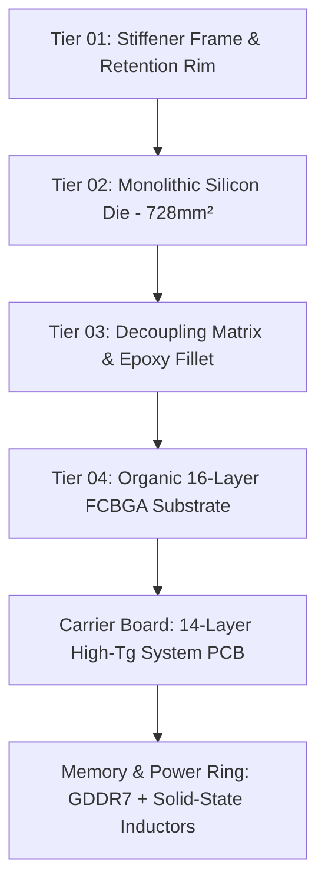

<div align="center">

# NEURAL CORE // NC-01 ULTRA-TENSOR

### Next-Generation Monolithic Silicon Architecture & Cognitive Compute Engine

[](https://neural-core-a-new-future.vercel.app/) 


<p>
  <strong>An interactive 3D silicon monograph for exploring futuristic compute architecture, packaging, and telemetry.</strong>
</p>

</div>

<p align="center">
  
</p>

> **Project status:** Experimental concept · **Specification revision:** `v2.4 - NOMINAL`
>
> **Disclaimer:** All hardware specifications, compute metrics, and packaging data are fictional and designed for visual storytelling, 3D composition, and interactive web experimentation.

## ✦ Overview

[Neural Core (NC-01)](https://neural-core-a-new-future.vercel.app/) is an exploratory 3D silicon monograph and interactive architectural web experience. It presents an exploded nanoscale hardware disassembly, simulated 512-core silicon fabric telemetry, and interactive cross-sectional packaging exploration through a cinematic technical interface.

```text
 _   _                      _    ____
| \ | | ___ _   _ _ __ __ _| |  / ___|___  _ __ ___
|  \| |/ _ \ | | | '__/ _` | | | |   / _ \| '__/ _ \
| |\  |  __/ |_| | | | (_| | | | |__| (_) | | |  __/
|_| \_|\___|\__,_|_|  \__,_|_|  \____\___/|_|  \___|
             NC-01 ULTRA-TENSOR // SYNAPSE ARCHITECTURE
```

## ◈ At a Glance

| System | Specification |
| :--- | :--- |
| **Process** | 3nm Monolithic FinFET |
| **Compute** | 512 symmetric compute tiles · 2D torus topology |
| **Peak Tensor Compute** | 890 TOPS · FP8 dense / sparse acceleration |
| **Memory** | Up to 96 GB high-bandwidth GDDR7 |
| **Fabric Bandwidth** | 1.8 TB/s sustained inter-tile bandwidth |
| **Interface** | PCI Express Gen 6.0 x16 / CXL 3.1 |

## ⌁ Contents

- [Silicon Architecture](#-silicon-architecture)
- [Hardware Specifications](#-hardware-specifications)
- [Workloads & Telemetry](#-workloads--telemetry)
- [Tech Stack](#-tech-stack)
- [Author & Credits](#-author--credits)

## ⌁ Silicon Architecture

Neural Core breaks down silicon packaging into four distinct fabrication tiers using interactive 3D camera staging and GSAP-driven scroll sequencing:



<p align="center">
  
</p>

### Tier 01 // Structural Retention Rim

- **Material:** Aircraft-grade CNC anodized silver alloy with satin micro-finish.
- **Dimensions:** `53.8mm × 53.8mm` with a `0.42mm` thickness.
- **Engineering:** 45° Pin-1 corner notch, 0.20mm inner chamfer lip, and calibrated vapor-chamber clamping interface.

### Tier 02 // Monolithic Compute Die

- **Process lithography:** TSMC 3nm Monolithic FinFET.
- **Die footprint:** `28.0mm × 26.0mm` with a 728 mm² die area.
- **Microarchitecture:** Repeating systolic multiplier arrays flanking high-density SRAM cache blocks.

### Tier 03 // Decoupling Matrix & Underfill

- **Passive arrays:** High-density `0402` and `0201` multi-rail MLCC capacitor banks.
- **Environmental sealing:** Continuous `0.6mm` glossy black epoxy underfill fillet protecting C4 interconnects.

### Tier 04 // High-Density FCBGA Substrate

- **Package stack:** 16-layer high-Tg organic laminate (`55.0mm × 55.0mm × 1.6mm`).
- **Metallurgy:** Taiyo dark matte charcoal soldermask, gold Pin-1 indexing, and ENIG test points.

## ◈ Hardware Specifications

| Specification Metric | Technical Detail |
| :--- | :--- |
| **Silicon Process** | 3nm Monolithic FinFET |
| **Compute Architecture** | 512 Symmetric Compute Tiles (2D Torus Topology) |
| **Peak Tensor Compute** | **890 TOPS** (FP8 Dense / Sparse Acceleration) |
| **Unified Memory** | Up to **96 GB** High-Bandwidth GDDR7 |
| **Interconnect Bandwidth** | **1.8 TB/s** Sustained Inter-Tile Fabric |
| **L3 Distributed Cache** | 256 MB Coherent Torus Mesh (**0.42 ns** latency) |
| **Host Interface** | PCI Express Gen 6.0 x16 / CXL 3.1 Switched Fabric |
| **Thermal Envelope** | 35W edge ingestion to 450W hyperscale datacenter |
| **Packaging Technology** | 16-Layer High-Tg ENIG Organic FCBGA |

## ⌁ Workloads & Telemetry

<p align="center">
  
</p>

The application features an interactive silicon fabric terminal tracking 512 simulated cores across 8 clusters in real time.

| Telemetry | Value |
| :--- | :--- |
| **Inter-core latency** | `0.42 ns` non-blocking 2D torus communication |
| **Simulated kernels** | `ROPE_ROTARY_EMB` · `ATTN_FLASH_V3` · `GELU_FUSED_TENSOR` |
| **LLM workload** | 185 tokens/sec for 70B FP8 models |
| **Context window** | 128K |
| **Target scenarios** | LLMs · robotics · spatial computing · CXL fabrics |

<p align="center">
  
</p>

## ⚙ Tech Stack

- **Core framework:** [Next.js](https://nextjs.org/) / [React](https://react.dev/)
- **3D visual engine:** [Three.js](https://threejs.org/) / WebGL with custom GLSL shaders
- **Motion and scrubbing:** [GSAP](https://greensock.com/gsap/) with [ScrollTrigger](https://greensock.com/scrolltrigger/)
- **Styling:** [Tailwind CSS](https://tailwindcss.com/)
- **Design language:** Dark sci-fi HUD terminal with an obsidian base, matrix-green accents, and monospace telemetry

## ✦ Author & Credits

- **Architect & Design:** **SHADOW CODES** ([@shadowcodesdev](https://github.com/shadowcodesdev))
- **Live Showcase:** [neural-core-a-new-future.vercel.app](https://neural-core-a-new-future.vercel.app/)

<div align="center">

### [Launch the Live Demo →](https://neural-core-a-new-future.vercel.app/)

</div>
